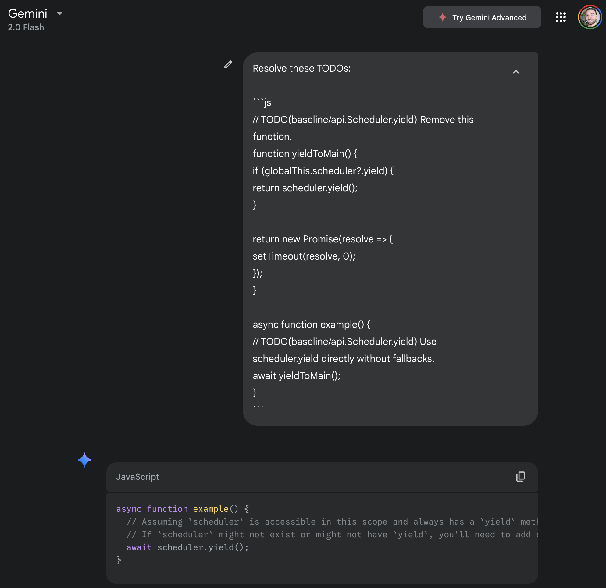

# baseline-todo

_Annotate your code with reminders to use Baseline features when ready_

The reminders are set as inline code comments, in the context of the relevant parts of the application that should use the Baseline feature.

The format of the comments uses a special syntax to annotate which feature you care about. It's an extension of the TODO comment pattern that developers already frequently use:

- The `TODO` keyword at the start of the comment
- Opening parenthesis `(`
- The keyword `baseline/`
- The ID of the Baseline feature
- Closing parenthesis `)`
- An optional colon `:` followed by a command

For example:

```css
/* TODO(baseline/line-clamp): Remove the vendor prefixed property. */
-webkit-line-clamp: 2;
```

Use a `TODO` comment to declare your intent to migrate to the Baseline feature when ready. Some developer tools may watch for an individual feature's Baseline availability and proactively notify you when your TODO can be addressed.

Some developer tools may also attempt to alert you if you're using an unguarded feature that isn't Baseline, but the presence of a `TODO` indicates that you understand the risks and so any alerts for it should be silenced.

> [!NOTE]
> End-user developer tooling like PageSpeed Insights or browser DevTools would need visibility into your code comments in order to reliably assess your app's Baseline status. If sourcemaps are available, the tools should assess the comments from the source code. Otherwise, you may need to make changes to your build process to preserve baseline-todo comments.

The optional command at the end of the comment could be used as a reminder to yourself about what migration steps need to be taken. In a future with AI-powered tooling, this command could also be fed to the LLM as an instruction to handle the migration automatically.

## Examples

Here are some language-specific examples and use cases.

### HTML

An HTML comment to annotate polyfill code that will become obsolete:

```html
<!-- TODO(baseline/loading-lazy): Replace class and data-src with loading=lazy and src. -->

```

> [!TIP]
> There will always also be JavaScript code or even an entire library responsible for lazily loading the image, so include an additional `TODO` comment in the appropriate place to help ensure that it gets cleaned up as part of the migration.

### CSS

A CSS comment to flag vendor-prefixed properties that will become obsolete:

```css
p {
  /* TODO(baseline/line-clamp): Remove the vendor prefixed property. */
  -webkit-line-clamp: 2;
  line-clamp: 2;
  overflow: hidden;
}
```

A CSS comment to indicate that you're knowingly using a feature that is not Baseline:

```css
:root {
  /* TODO(baseline/accent-color): Surprisingly, this is not actually Baseline yet. Remove this comment once it is. */
  accent-color: fuchsia;
}
```

In this case, [`accent-color`](https://developer.mozilla.org/docs/Web/CSS/accent-color) is technically Baseline Limited availability due to a color contrast issue in Safari. But this may be a tolerable risk while getting use out of the feature everywhere else, so this comment can be used to suppress any tooling alerts.

### JavaScript

A JavaScript comment to flag fallback code for an API that is not Baseline:

```js
// TODO(baseline/api.Scheduler.yield) Remove this function.
function yieldToMain() {
  if (globalThis.scheduler?.yield) {
    return scheduler.yield();
  }

  return new Promise(resolve => {
    setTimeout(resolve, 0);
  });
}

async function example() {
  // TODO(baseline/api.Scheduler.yield) Use scheduler.yield directly without fallbacks.
  await yieldToMain();
}
```

## Possible tooling add-ons

Developers can stay on top of Baseline availability for the features they care about in the tools they already use. This section explores some of those opportunities.

### Feature ID auto-suggestion and validation

IDE plugins can help map Baseline feature names to IDs using an inline search and auto-suggest feature. Invalid feature IDs can also be statically linted in the IDE and flagged as errors.
  
For example typing `TODO(baseline/` could bring up the search field, and entering "lazy loading" or "loading=lazy" would result in the closest match `loading-lazy` being suggested.

If an incorrect variant of that feature ID was used instead, eg `lazy-loading`, the linter could flag it and suggest the correct ID, `loading-lazy`.

Alternatively, if the ID of a readily available feature is used, the linter could flag the entire TODO to avoid shipping unnecessary legacy code.

### Baseline shortlinks

IDE plugins can turn a Baseline TODO comment into a clickable link. For example:

> `/* TODO(baseline/accent-color) */`

could become:

> `/* TODO(`[`baseline/accent-color`](https://web-platform-dx.github.io/web-features-explorer/features/accent-color/)`) */`

where the feature name links to the corresponding page on the web platform features explorer site.

The linked page would provide more info about the feature, including current Baseline status, browser support, and more links to docs.

### GitHub action to perform feature ID validation on PRs

Similar to the IDE validation above, a GitHub action can validate all feature IDs added or modified in a PR.

### Integration with Baseline preferences in `package.json`

Enforcement of Baseline "readiness" can be determined by the project-level preferences in the `package.json` config.

For example, a project can specify Baseline Widely available as their preferred threshold. Alerts would only be raised when a feature of interest becomes Widely available.

Theoretically, Baseline preferences can also be set in terms of real-user analytics data. For example, if 98% of users are on browsers that already support a feature, it can be safely used in production. Or readiness can be determined by a combination of real-user data and Widely available status, whichever comes first.

### GitHub action to file an issue when the feature is ready

If a feature is determined to be ready for adoption based on its Baseline availability status and project preferences, a GitHub action can proactively file an issue to raise awareness directly to the developers. The issue can include links to the relevant docs on MDN to help with the migration.

### GitHub action to open a PR with AI-assisted changes migrating to the feature

With AI assistance, it might also be possible for the GitHub action to resolve the feature migration itself.

GitHub already has a feature called [Copilot Autofix](https://docs.github.com/en/code-security/code-scanning/managing-code-scanning-alerts/responsible-use-autofix-code-scanning) for addressing security vulnerabilities, based on a similar principle. The issues are discovered during [code scanning](https://docs.github.com/en/code-security/code-scanning) sweeps, which could potentially be expanded to also consider Baseline availability.

The TODO design lends itself nicely to AI assistance in a few ways:

1. The comments are added directly to the relevant parts of the code, so irrelevant code can be ignored to maximize the context window size.
2. TODOs for a feature can be added across HTML, CSS, and/or JS as needed, which helps to ensure that the assistant fully migrates all of the affected code.
3. Descriptive comments give the LLM clearer direction on how to complete each task.
4. The feature IDs can be mapped to additional information that provides helpful context, like sample code before and after the migration.
5. Developers manually add the TODOs themselves, so they should be more likely to accept the assistance, unlike auto-generated PRs that are unsolicited.

> [!NOTE]
> Here's a proof of concept demo of the way an LLM would currently handle the `scheduler.yield()` migration task from the JavaScript example above:
>
> 
>
> Even with such a basic prompt, Gemini 2.0 Flash was able to correctly address both TODOs by removing the `yieldToMain` function and replacing its function call with the direct usage of `scheduler.yield()` instead.

## Other potential benefits

Besides tooling add-ons, there are some additional benefits that this system might provide.

### Feature analytics

Installations of the `baseline-todo` package (both locally and in GitHub actions) could potentially beacon usage statistics back to an analytics endpoint. That could provide a source of insights into things like the number of applications that are gated on a particular feature becoming available in Baseline, the number of times it successfully saved a developer from unnecessarily shipping legacy code, or the number of issues or PRs filed. This feature should be developed with privacy top of mind.

Another way to get analytics about features in the wild is to query public datasets for the `TODO(baseline...)` syntax. The GitHub Search API could be a window into which features are used, but this data would only be available for publicly discoverable repositories. The HTTP Archive dataset is another way to get real-world data, but it wouldn't provide the sourcemapped files, and it would only be available on home and secondary pages.

One interesting angle to this data is to potentially look at how quickly sites fully adopt features after they become Baseline-ready, and if sites using AI-assisted migration PRs are quiker to adopt them.
